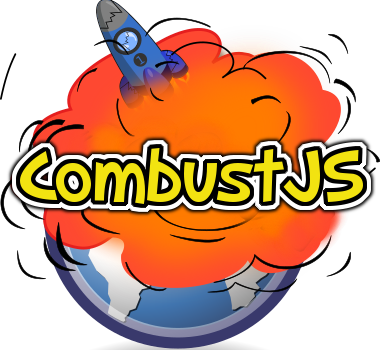

# CombustJS



CombustJS is a noBackend framework that mimics Firebase behavior. It allows developers to create real-time (push-based), persistent applications without writing a line of back-end code. CombustJS was developed over the course of three weeks and successfully recreates the following firebase functionality:

1. Firebase-like object-relational mapping. This means that the entire backend database can be treated, by the front-end developer, as a giant JavaScript object that can be modified, set, and pushed (similar to an array or a list) into. This is an incredibly powerful abstraction because every experienced front-end developer has a mental model of how JavaScript objects work and are stored, and as a result, they know how to structure and use data in the CombustJS backend.
2. Firebase-like push-notifications. CombustJS clients can subscribe to any piece of data, and receive updates when that data is updated in realtime. This makes developing real-time, persistent, data-driven applications really easy. In our getting started tutorial below, a real-time chat application (with data persistence!) can be written in 9 lines of JavaScript.
3. Baked in authentication and authorization. With an additional 40 lines of frontend-only JavaScript / JQuery code user accounts can be added to the chat application. In addition to user accounts, the ability to restrict parts of the database based on user-priviledge is also built-in. Authentication is managed via JWT's.
4. Automatic RESTful API. The CombustJS automatically generates a RESTful API that allows you to access any piece of data in the database, if you have the right permissions, with a simple HTTP request; you can do it right in your browser!
5. A testing suite with over 100 tests for various functionality, as well as full documentation for our [client library](http://crunch-crew.github.io/dev-api-docs/) and [backend server](http://crunch-crew.github.io/client-library-docs/) (for developers who wish to contribute). Please see the documentation section below for links to the online documentation.

All of these features makes it incredibly easy to write real-time, persistent, single-page applications. Take a look at the following code that implements a chat-client, with user management:


Check out our [chat application](gettingStarted.md) tutorial to see just how easy it is to develop real-time, persistent applications without writing a line of back-end code.

## Architecture


## Documentation

1. [CombustJS backend documentation (developer facing)](http://crunch-crew.github.io/dev-api-docs/)
2. [CombustJS client Library documentation (user facing)](http://crunch-crew.github.io/client-library-docs/)

## Installation

1. [Install RethinkDB] (http://rethinkdb.com/docs/install/)
2. Use the RethinkDB GUI to create a database and table (name them whatever you want)
3. Modify config.js to point to the right database and tablename
4. Install the CombustJS NPM module - `npm install --save combust-js`
5. Install the Express NPM module - `npm install --save express`
6. Create a server.js file

```javascript
var express = require('express');
var combust = require('combust-js');
var port = process.env.port || 3000;
var app = express();
var server = combust(app, port);
```
## Usage

1. Run RethinkDB by navigating to the directory where you want data to be stored and executing `rethinkdb`
2. Run the server using node `node server.js`

Thats it! You can start writing applications that interact with the server using the CombustJS client library (insert bower / getting started instructions here)

## Testing

Make sure RethinkDB and the Node server are running, then navigate to node_modules/combust-js and execute `grunt test`

## Contributing

1. Fork it!
2. Create your feature branch: `git checkout -b my-new-feature`
3. Commit your changes: `git commit -m 'Add some feature'`
4. Push to the branch: `git push origin my-new-feature`
5. Submit a pull request

## Authors

1. Richard Artoul
2. Kuldeep Dhanjal
3. Alex Mendez
4. Jack Zhang

## License

MIT
